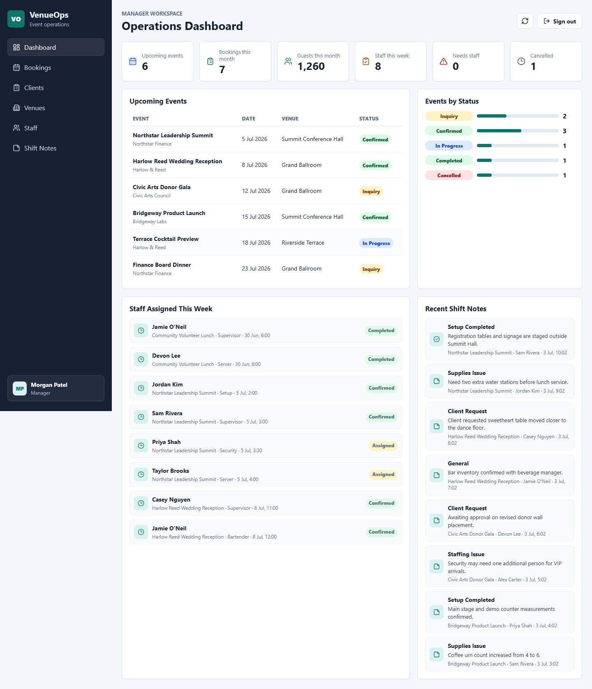
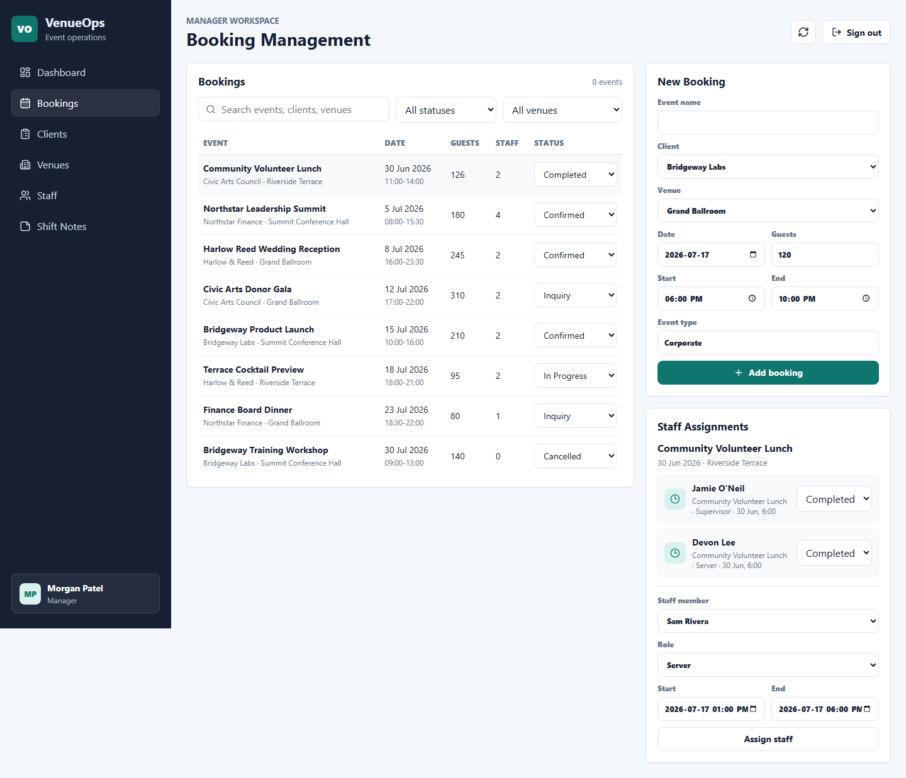
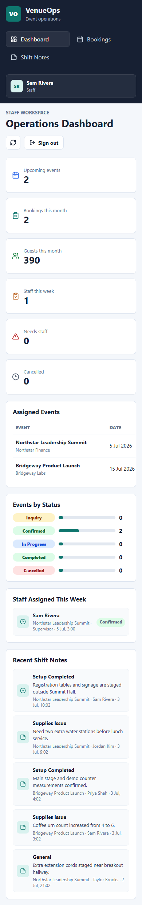
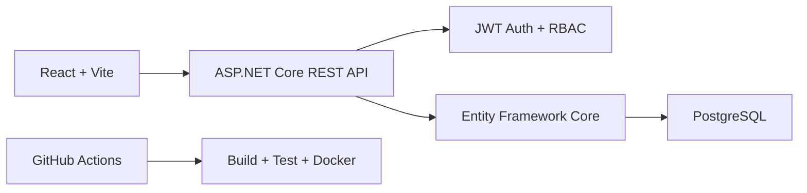

# VenueOps

Full-stack event operations platform for venue bookings, staff assignments, guest counts, and shift notes. Built with ASP.NET Core, React, PostgreSQL, Docker, and GitHub Actions.

VenueOps is a portfolio-ready business application inspired by real hospitality and event operations work. It is designed to look and behave like internal software a venue team could use to coordinate events, staff shifts, client requests, and operational notes.

## Screenshots







## Why This Project Exists

Generic student apps rarely show how software supports real workflows. VenueOps turns event and hospitality experience into a believable full-stack system with authentication, role-based access, relational data, seeded demo records, tests, Docker, and CI.

## Core Features

- JWT authentication with BCrypt password hashing
- Role-based access control for Admin, Manager, Staff, and Demo users
- Role-aware dashboard metrics for bookings, guest counts, staffing, cancellations, and notes
- Event booking CRUD workflow with status tracking
- Client and venue/room management
- Staff assignment workflow with shift roles, times, statuses, and notes
- Shift note creation for setup, guest count changes, incidents, closing notes, supplies, and staffing issues
- Search and filtering by event text, status, venue, assigned staff, and date range
- PostgreSQL schema with EF Core migrations and indexes
- Seeded demo data for venues, clients, users, bookings, staff assignments, and shift notes
- React UI with responsive layout, status badges, forms, tables, loading/error states, and read-only demo mode
- Backend unit and integration tests
- Frontend component/workflow tests
- Docker Compose local environment
- GitHub Actions CI for backend, frontend, and Docker builds

## Tech Stack

| Area | Technology |
| --- | --- |
| Backend | ASP.NET Core 8 Web API, C# |
| Frontend | React, TypeScript, Vite |
| Database | PostgreSQL |
| ORM | Entity Framework Core |
| Authentication | JWT Bearer tokens, BCrypt password hashes |
| Authorization | ASP.NET Core role policies |
| Tests | xUnit, ASP.NET Core TestHost, SQLite in-memory, Vitest, Testing Library |
| DevOps | Docker, Docker Compose, GitHub Actions |

## Architecture

See [docs/architecture/architecture.md](docs/architecture/architecture.md).



## Demo Accounts

All seeded demo accounts use this safe fake password:

```text
VenueOpsDemo!2026
```

| Role | Email | Access |
| --- | --- | --- |
| Admin | admin@venueops.local | Users, venues, bookings, assignments, dashboard, notes |
| Manager | manager@venueops.local | Bookings, clients, assignments, dashboard, notes |
| Staff | sam.staff@venueops.local | Assigned events, assignment statuses, shift notes |
| Demo | demo@venueops.local | Read-only demo browsing |

## Local Setup

### Prerequisites

- .NET 8 SDK
- Node.js 22+
- Docker Desktop, if using Docker Compose
- Git

This repo was built on Windows. The same commands work on macOS/Linux with normal shell path adjustments.

### Backend

```bash
dotnet restore VenueOps.sln
dotnet tool restore
dotnet ef database update --project backend/src/VenueOps.Api/VenueOps.Api.csproj --startup-project backend/src/VenueOps.Api/VenueOps.Api.csproj
dotnet run --project backend/src/VenueOps.Api/VenueOps.Api.csproj
```

The API runs at `http://localhost:5000` when launched through Docker. Local `dotnet run` may use the ports in `launchSettings.json`.

### Frontend

```bash
cd frontend
npm ci
npm run dev
```

Set `VITE_API_BASE_URL=http://localhost:5000/api` when pointing at the Docker backend. For UI-only screenshots without a backend, set `VITE_USE_MOCKS=true`.

## Docker Setup

```bash
docker compose up --build
```

Then open:

- Frontend: http://localhost:8080
- API Swagger: http://localhost:5000/swagger
- Health check: http://localhost:5000/health

The backend applies migrations and seeds demo data at startup when `SeedDemoData=true`.

## Environment Variables

See [.env.example](.env.example).

Important variables:

| Variable | Purpose |
| --- | --- |
| `ConnectionStrings__DefaultConnection` | PostgreSQL connection string |
| `Jwt__Issuer` | JWT issuer |
| `Jwt__Audience` | JWT audience |
| `Jwt__SigningKey` | Long random signing key |
| `SeedDemoData` | Seeds demo data when true |
| `VITE_API_BASE_URL` | Frontend API base URL |
| `VITE_USE_MOCKS` | Enables frontend-only mock mode |

## Database Schema Overview

- `users`: authenticated users with roles and password hashes
- `clients`: client organizations and contact details
- `venue_rooms`: venue spaces, locations, capacities, and active status
- `event_bookings`: event name, client, venue, date/time, guest count, type, status, notes
- `staff_assignments`: event, staff user, shift role, start/end, assignment status, notes
- `shift_notes`: event notes written by staff/managers with note type and pinned status

Useful indexes are included for user email, event date, event status, venue/date lookup, assignment lookup, and shift note creation time.

## API Endpoints Summary

| Area | Endpoints |
| --- | --- |
| Auth | `POST /api/auth/login`, `GET /api/auth/me` |
| Dashboard | `GET /api/dashboard` |
| Bookings | `GET /api/bookings`, `GET /api/bookings/{id}`, `POST /api/bookings`, `PUT /api/bookings/{id}`, `PATCH /api/bookings/{id}/status`, `DELETE /api/bookings/{id}` |
| Clients | `GET /api/clients`, `GET /api/clients/{id}`, `POST /api/clients`, `PUT /api/clients/{id}`, `DELETE /api/clients/{id}` |
| Venues | `GET /api/venues`, `GET /api/venues/{id}`, `POST /api/venues`, `PUT /api/venues/{id}` |
| Staff Assignments | `GET /api/staff-assignments`, `POST /api/staff-assignments`, `PUT /api/staff-assignments/{id}`, `PATCH /api/staff-assignments/{id}/status`, `DELETE /api/staff-assignments/{id}` |
| Shift Notes | `GET /api/shift-notes`, `POST /api/shift-notes` |
| Users | `GET /api/users`, `GET /api/users/staff`, `POST /api/users`, `PUT /api/users/{id}` |

## Testing

Run all backend tests:

```bash
dotnet test VenueOps.sln
```

Run frontend tests:

```bash
cd frontend
npm test
```

Run frontend lint/build:

```bash
cd frontend
npm run lint
npm run build
```

Test coverage includes:

- User login
- Booking creation
- Booking status update
- Staff assignment
- Shift note creation
- Validation failure for invalid booking windows
- Unauthorized demo-role mutation prevention
- Frontend login, role-aware UI, and booking filtering

## CI/CD

The GitHub Actions workflow in [.github/workflows/ci.yml](.github/workflows/ci.yml):

- Restores and builds the .NET backend
- Runs backend tests
- Installs frontend dependencies
- Runs frontend lint, tests, and production build
- Builds backend and frontend Docker images

## Deployment

No paid service is required to run VenueOps. The strongest guaranteed demo path is local Docker Compose.

Free-tier deployment notes are in [docs/deployment.md](docs/deployment.md). Current official docs indicate [Render offers free web services](https://render.com/docs/free), [Vercel offers a free Hobby plan](https://vercel.com/docs/plans/hobby), and [Neon offers a free Postgres plan](https://neon.com/docs/introduction/plans) for prototypes and side projects. Review provider limits before deploying.

Suggested free deployment:

- Backend API on Render free web service
- PostgreSQL on Neon free tier
- Frontend on Vercel Hobby
- `VITE_API_BASE_URL` set to the backend `/api` URL
- API CORS origin tightened to the frontend URL after the Vercel URL is known

Live demo status:

- Frontend: pending
- API health check: pending

## Security Notes

- Passwords are stored as BCrypt hashes.
- JWT signing keys are configured through environment variables.
- `.env` files are ignored by Git.
- Demo credentials are fake and safe for portfolio review.
- Demo user is read-only in the UI and denied mutation endpoints by API authorization.
- Admin-only endpoints protect user and venue management.
- Manager endpoints support booking and staffing operations.
- Staff users can only see assigned bookings and can only add notes to assigned events.
- Enable GitHub secret scanning and branch protection before accepting outside contributions.

## Trade-offs

- The frontend includes a mock mode for screenshots/tests when no backend is running. Production/local Docker mode uses the real API.
- The API uses a single project for speed and readability. A larger production system might split domain, application, and infrastructure layers.
- Demo seeding runs at startup for portfolio convenience. Production systems should use stricter seed controls.
- The dashboard uses simple aggregate queries rather than a reporting cache.

## Future Improvements

- Calendar view for event schedule
- CSV export for bookings and assignments
- Email notifications for shift confirmations
- Audit log for status changes
- File attachments for floor plans and BEO documents
- More granular permissions and refresh tokens
- End-to-end tests against Docker Compose

## AI-Assisted Development Notes

AI-assisted tooling supported planning, implementation, debugging, visual QA, and documentation. The app does not require paid AI APIs to run, and the code was built and tested locally.

## Resume / LinkedIn

See:

- [docs/linkedin-project-entry.md](docs/linkedin-project-entry.md)
- [docs/resume-bullets.md](docs/resume-bullets.md)

Example resume bullet:

> Built a full-stack event operations platform using ASP.NET Core, React, PostgreSQL, Docker, and GitHub Actions to manage venue bookings, staff assignments, guest counts, and shift notes.
