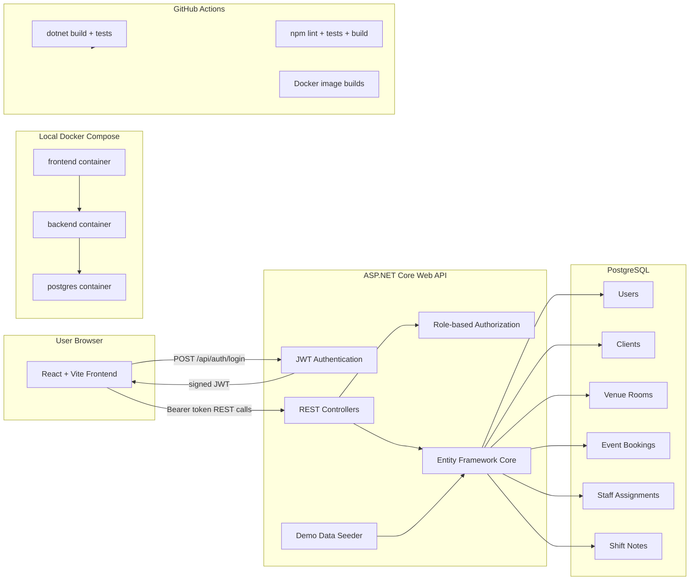

# VenueOps Architecture

## Auth Flow

1. A demo account signs in through `POST /api/auth/login`.
2. The API validates the BCrypt password hash and returns a JWT.
3. The frontend stores the token in memory for the active session.
4. API requests include `Authorization: Bearer <token>`.
5. Controllers enforce role-based access for Admin, Manager, Staff, and Demo users.

## Local Runtime

`docker compose up --build` starts PostgreSQL, the ASP.NET Core API, and the Nginx-hosted React app. The API applies EF Core migrations on startup and seeds demo data when `SeedDemoData=true`.
